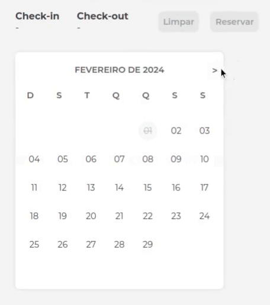

# Calendar Component

Um componente simples e reutilizável para lidar com reserva de datas.

## Instalação

Use o gerenciador de pacotes npm para instalar o Calendar.

    npm install

## Iniciando

Execute o seguinte comando para iniciar o projeto:

    npm start 

## Imports e Uso

Importe o componente Calendar no seu arquivo e integre-o conforme necessário.

    import Calendar from 'caminho/do/seu/Calendar';

    // ...
    
    <Calendar
      onDateSelect={(date) => handleDateSelect(date)}
      dateStyles={{
	    backgroundColor:  "#FFF",
		hoverColor:  "#FAC5D4",
	    selectedColor:  "#F45692",
	    disabledColor:  "#f8f8f8",
		poupupColor:  "#fcf3f5",
	   }}
      customDates={customDates}
    />

## Datas Customizadas

Personalize as datas impedidas de acordo com suas necessidades, utilizando as opções disponíveis no componente.

    const  customDates  = [
    { type:  "block", date:  "2024-03-03" },
    { type:  "booked", date:  "2024-04-04" },
    { type:  "booked", date:  "2024-04-05" },
    { type:  "block", date:  "2024-03-16" } ]

